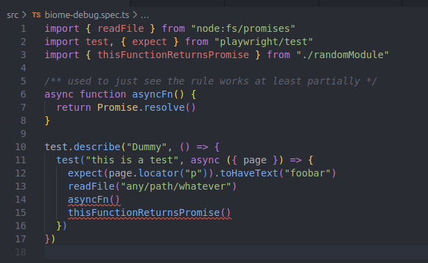

# Biome debug

This is as simple as possible repository for reproducing [biome](https://github.com/biomejs/biome) issues.

## Current repro case: noFloatingPromises

Biome does not report imported async function return values as floating promises when imported from external package. 

See [biome-debug.spec.ts](./src/biome-debug.spec.ts).

## How to reproduce

1. Run `npm install`
2. Run `npm run lint`

It only reports 2 out of 4 floating promises in [biome-debug.spec.ts](./src/biome-debug.spec.ts).